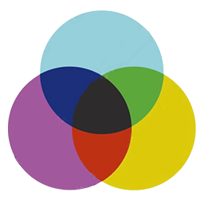

# Color Space Visualizer 

A 3D tool for exploring RGB, HLS, and HSV color spaces in real-time. Built in a day, so please don't look at the code.

Check it out here: [color-space-visualizer.pages.dev](https://color-space-visualizer.pages.dev/)

## What it looks like


<details>
<summary>Mobile screenshots</summary>


</details>

## What you can do

- Explore different 3D color models (RGB cube, HLS double cone, HSV cone)
- Full 3D camera controls (rotate, zoom, pan)
- Switch between color spaces with real-time updates
- Save colors as points in 3D space
- Create interpolated colors between saved points
- Toggle grid overlay for reference
- Use it on your phone, I actually made it responsive

## Running it locally

You can use any JS runtime (I used Bun). Then:

```bash
git clone https://github.com/sasoder/color-space-visualizer.git
cd color-space-visualizer
bun install
bun dev
```

Head to `http://localhost:5173` and you're good to go.

## Credits

Shoutout Tino Weinkauf for the course DD2258 that inspired this.

## License

MIT License
